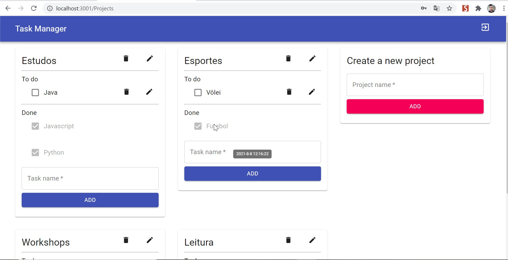
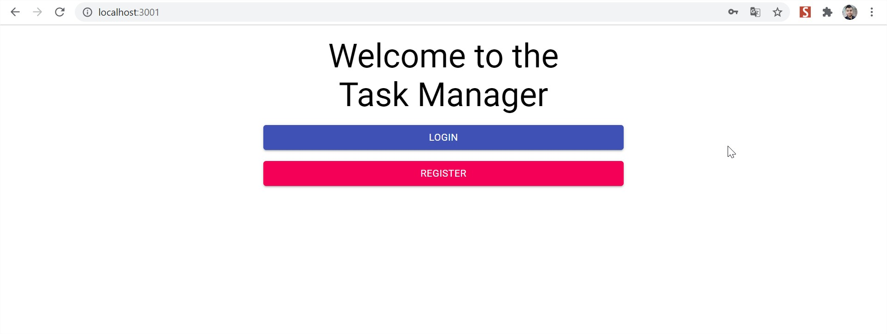

# Task Manager Test



> Interface of the project

### Requirements:

All the main requirements have been done:

- [x] One user may have several projects
- [x] One user can access his projects only
- [x] Each project may include multiple tasks
- [x] Each task must have a description, creation date and finish date
- [x] The user needs to have a simple option to mark the tasks as completed when accessing the task list
- [x] Each task should have its termination date visible as a tooltip, if available, and some visual way of identifying
its status
- [x] A task that was defined as finished should not be edited nor removed
- [x] When a task or Project is added our deleted, the page should not fully refresh, so that users have a good
experience

### Non funcional requirements:

For now I have used Json Server to simulate the back-end.

- [x] The application should be written in Javascript.
- [ ] The application backend should be written in Node.js or GoLang.
- [x] The authentication and registration layers should be coded and not based on pre-existing modules (such as
Passport).
- [x] For the frontend, javascript frameworks can be used (Angular, React, Polymer or others).
- [x] Components should be used to promote increased code reusage (react or angular components,
webcomponents or other alternatives)

Extras:

Still missing the Unit tests

- [x] Build tools (e.g. grunt or gulp)
- [ ] Unit tests
## 🚀 Installing the Task-Manager-Test

To install and run the project, follow these steps:

Install Json-Server:
```
npm i json-server
```

Install all the dependencies:
```
npm i
```

On the folder scr/Assets execute this command to run the 'Back-End' over the 3000 port:
```
json-server --watch db.json
```

On the root execute this command to run the 'Front-End' over the 3001 port:
```
npm start
```

## ☕ How does it look?

Showing the Task Manager:



> Welcome Screen -> Login or Register


> Register a new user


> Login


> Main interface for the project


> Responsive Layout


> Component for invalid route

## 🤝 Thanks for the opportunity - Luiz Nai - 08/08/2021.